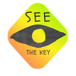
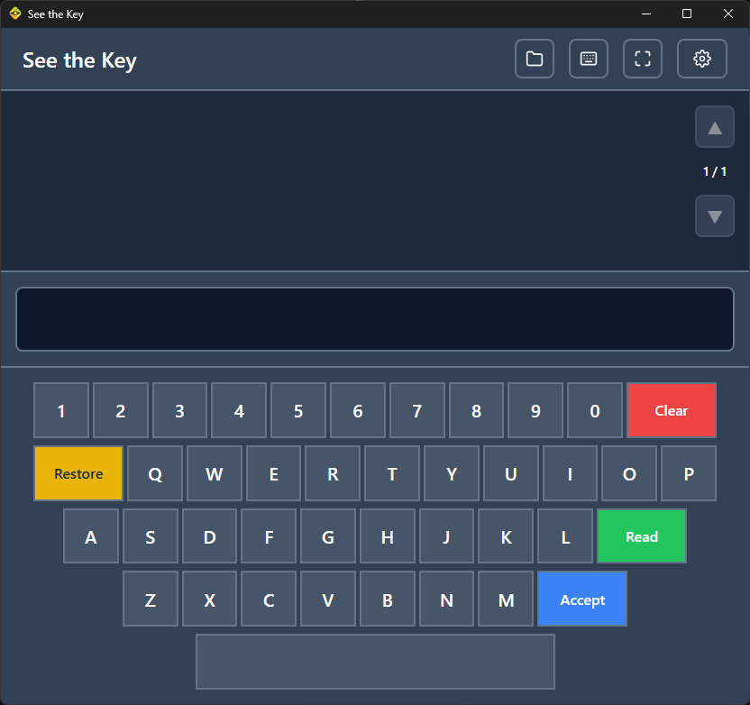
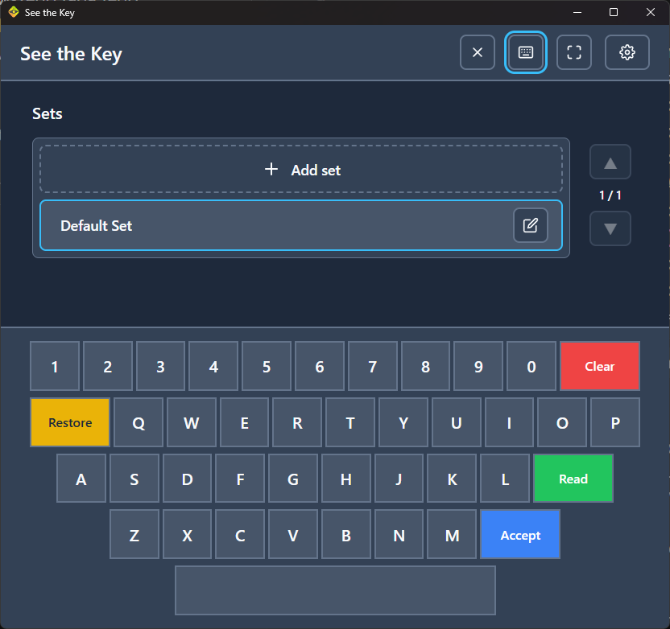

<p align="center">
  
</p>

<h1 align="center">See the Key</h1>

<p align="center">
  <strong>On-screen keyboard with text-to-speech for AAC users</strong>
</p>

<p align="center">
  <a href="https://github.com/dkedzia/see-the-key/releases/latest">
    
  </a>
  <a href="https://github.com/dkedzia/see-the-key/blob/master/LICENSE">
    
  </a>
  <a href="https://github.com/dkedzia/see-the-key/releases/latest">
    
  </a>
</p>

<p align="center">
  <a href="https://github.com/dkedzia/see-the-key/releases/latest">
    
  </a>
</p>


<table>
  <tr>
    <td align="center">
      
      <br/>
    </td>
    <td align="center">
      
      <br/>
    </td>
  </tr>
</table>


## Features

- **On-screen keyboard** — large, easy-to-click keys optimized for eye-tracking
- **Text-to-speech** — system speech synthesizer reads your messages aloud
- **Message history** — quick access to previously typed phrases
- **Character sets** — custom keyboard layouts for different needs
- **Multi-language support** — 35 European languages with native diacritics
- **Works offline** — no internet connection required
- **Lightweight** — fast startup, minimal resource usage


## For Whom

This application is designed for **AAC (Augmentative and Alternative Communication)** users who:

- Cannot use their hands due to motor disabilities
- Control the mouse cursor via **eye-tracking** devices
- Use dedicated clicking software (dwell click, switch access, etc.)


## Requirements

| Requirement | Details |
|-------------|---------|
| **Operating System** | Windows 11 (primary target) |
| **Input** | Mouse cursor control (e.g., eye-tracking + clicking software) |
| **Internet** | Not required — works fully offline |


## Quick Start

1. **Download** the latest installer from [Releases](https://github.com/dkedzia/see-the-key/releases/latest)
2. **Run** the `.exe` installer
3. **Launch** See the Key and start typing!


## Usage

| Action | Description |
|--------|-------------|
| **Type** | Click letters on the on-screen keyboard |
| **Read** | Accepts text, adds to history, and reads it aloud |
| **Accept** | Accepts text and moves to history (no speech) |
| **Clear** | Clears current text; if empty, removes last history item |
| **Restore** | Inserts previous history item into the editor |

Each history item has dedicated buttons: **Read**, **Restore**, **Delete**.


## Supported Languages

<details>
<summary>Click to expand full list (35 languages)</summary>

| Language | Native diacritics |
|----------|-------------------|
| Albanian | ç, ë |
| Belarusian | ў, ё |
| Bosnian | č, ć, dž, đ, š, ž |
| Bulgarian | — |
| Croatian | č, ć, dž, đ, š, ž |
| Czech | á, č, ď, é, ě, í, ň, ó, ř, š, ť, ú, ů, ý, ž |
| Danish | æ, ø, å |
| Dutch | — |
| English | — |
| Estonian | ä, ö, õ, ü, š, ž |
| Finnish | ä, ö |
| French | à, â, ç, é, è, ê, ë, î, ï, ô, ù, û, ü, ÿ |
| German | ä, ö, ü, ß |
| Greek | — |
| Hungarian | á, é, í, ó, ö, ő, ú, ü, ű |
| Icelandic | þ, ð, æ |
| Italian | à, è, é, ì, ò, ù |
| Latvian | ā, č, ē, ģ, ī, ķ, ļ, ņ, š, ū, ž |
| Lithuanian | ą, č, ė, ę, į, š, ų, ū, ž |
| Luxembourgish | ä, é, ë |
| Macedonian | ѓ, ќ, ѕ, џ |
| Maltese | ċ, ġ, ħ, ż |
| Montenegrin | č, ć, dž, đ, š, ž |
| Norwegian | æ, ø, å |
| Polish | ą, ć, ę, ł, ń, ó, ś, ź, ż |
| Portuguese | á, â, ã, à, ç, é, ê, í, ó, ô, õ, ú, ü |
| Romanian | ă, â, î, ș, ț |
| Russian | — |
| Serbian | č, ć, dž, đ, š, ž |
| Slovak | á, ä, č, ď, é, í, ĺ, ľ, ň, ó, ô, ŕ, š, ť, ú, ý, ž |
| Slovenian | č, š, ž |
| Spanish | á, é, í, ó, ú, ñ, ü |
| Swedish | ä, å, ö |
| Turkish | ç, ğ, ı, ö, ş, ü |
| Ukrainian | і, ї, є, ґ |

</details>


## Building from Source

### Prerequisites

- **Node.js** (LTS version)
- **Rust** (via rustup)
- **Tauri CLI** (`npm install -g @tauri-apps/cli`)

### Development

```bash
# Install dependencies
npm install

# Run in development mode
npm run tauri:dev

# Build for production
npm run tauri:build
```

### Cross-compiling for Windows (from Linux)

```bash
rustup target add x86_64-pc-windows-gnu
sudo apt install gcc-mingw-w64-x86-64
npm run tauri build -- --target x86_64-pc-windows-gnu
```

Output: `src-tauri/target/x86_64-pc-windows-gnu/release/see-the-key.exe`


## Tech Stack

| Technology | Purpose |
|------------|---------|
| **Tauri 2** | Native desktop app framework |
| **React 19** | UI components |
| **TypeScript** | Type-safe development |
| **Zustand** | State management |
| **i18next** | Internationalization |


## License

This project is licensed under the **MIT License** — see the [LICENSE](LICENSE) file for details.


<p align="center">
  Made with care for AAC users
  <br/>
  <a href="https://github.com/dkedzia/see-the-key">GitHub</a> · <a href="https://github.com/dkedzia/see-the-key/issues">Report Bug</a> · <a href="https://github.com/dkedzia/see-the-key/releases">Releases</a>
</p>
